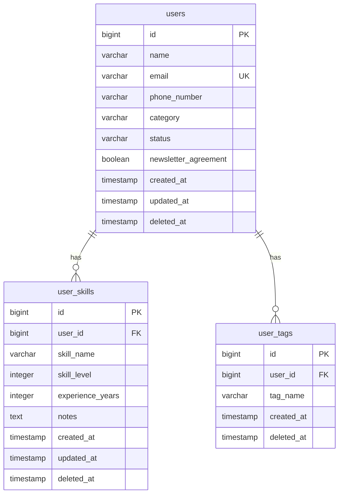

# 3-1 テーブル定義書

## データベース概要
- **データベース名**: traineedb
- **DBMS**: PostgreSQL 15
- **文字コード**: UTF-8
- **照合順序**: ja_JP.UTF-8

## テーブル一覧

### 1. users（ユーザー）

**概要**: 研修生の基本情報を管理するマスターテーブル

| # | Column | Type | PK | NN | UQ | FK | Default | Remarks |
|---|--------|------|----|----|----|----|---------|---------|
| 1 | id | BIGSERIAL | ✔ | ✔ | | | | 主キー |
| 2 | name | VARCHAR(100) | | ✔ | | | | ユーザー名 |
| 3 | email | VARCHAR(255) | | ✔ | ✔ | | | メールアドレス |
| 4 | phone_number | VARCHAR(20) | | | | | | 電話番号 |
| 5 | category | VARCHAR(50) | | ✔ | | | | カテゴリー（Level 0-5） |
| 6 | status | VARCHAR(20) | | ✔ | | | | ステータス（有効/無効） |
| 7 | newsletter_agreement | BOOLEAN | | | | | FALSE | メルマガ配信同意 |
| 8 | created_at | TIMESTAMP | | ✔ | | | NOW() | 作成日時 |
| 9 | updated_at | TIMESTAMP | | ✔ | | | NOW() | 更新日時 |
| 10 | deleted_at | TIMESTAMP | | | | | NULL | 論理削除日時 |

**インデックス**:
- PRIMARY KEY (id)
- UNIQUE INDEX ux_users_email (email) WHERE deleted_at IS NULL
- INDEX ix_users_deleted_at (deleted_at)
- INDEX ix_users_category (category)
- INDEX ix_users_status (status)

**制約**:
- CHECK (length(name) <= 100)
- CHECK (length(email) <= 255)
- CHECK (email ~* '^[A-Za-z0-9._%+-]+@[A-Za-z0-9.-]+\.[A-Za-z]{2,}$')
- CHECK (status IN ('有効', '無効'))

---

### 2. user_skills（ユーザースキル）

**概要**: ユーザーが保有するスキル情報を管理（1:N関係）

| # | Column | Type | PK | NN | UQ | FK | Default | Remarks |
|---|--------|------|----|----|----|----|---------|---------|
| 1 | id | BIGSERIAL | ✔ | ✔ | | | | 主キー |
| 2 | user_id | BIGINT | | ✔ | | ✔ | | → users.id |
| 3 | skill_name | VARCHAR(100) | | ✔ | | | | スキル名 |
| 4 | skill_level | INTEGER | | ✔ | | | | スキルレベル（0-5） |
| 5 | experience_years | INTEGER | | | | | | 経験年数 |
| 6 | notes | TEXT | | | | | | 備考 |
| 7 | created_at | TIMESTAMP | | ✔ | | | NOW() | 作成日時 |
| 8 | updated_at | TIMESTAMP | | ✔ | | | NOW() | 更新日時 |
| 9 | deleted_at | TIMESTAMP | | | | | NULL | 論理削除日時 |

**インデックス**:
- PRIMARY KEY (id)
- INDEX ix_user_skills_user_id (user_id) WHERE deleted_at IS NULL
- INDEX ix_user_skills_deleted_at (deleted_at)
- INDEX ix_user_skills_skill_level (skill_level)

**制約**:
- FOREIGN KEY (user_id) REFERENCES users(id) ON DELETE CASCADE
- CHECK (skill_level >= 0 AND skill_level <= 5)
- CHECK (experience_years >= 0)
- CHECK (length(skill_name) <= 100)
- CHECK (length(notes) <= 500)

**備考**:
- スキルレベルの定義:
  - 0: 未経験
  - 1: 1年未満
  - 2: 1-2年
  - 3: 2-3年
  - 4: 3-5年
  - 5: 5年以上

---

### 3. user_tags（ユーザータグ）

**概要**: ユーザーに付与されたタグ（スキルエリア）を管理

| # | Column | Type | PK | NN | UQ | FK | Default | Remarks |
|---|--------|------|----|----|----|----|---------|---------|
| 1 | id | BIGSERIAL | ✔ | ✔ | | | | 主キー |
| 2 | user_id | BIGINT | | ✔ | | ✔ | | → users.id |
| 3 | tag_name | VARCHAR(50) | | ✔ | | | | タグ名 |
| 4 | created_at | TIMESTAMP | | ✔ | | | NOW() | 作成日時 |
| 5 | deleted_at | TIMESTAMP | | | | | NULL | 論理削除日時 |

**インデックス**:
- PRIMARY KEY (id)
- UNIQUE INDEX ux_user_tags_user_tag (user_id, tag_name) WHERE deleted_at IS NULL
- INDEX ix_user_tags_user_id (user_id) WHERE deleted_at IS NULL
- INDEX ix_user_tags_deleted_at (deleted_at)

**制約**:
- FOREIGN KEY (user_id) REFERENCES users(id) ON DELETE CASCADE
- CHECK (length(tag_name) <= 50)

**ビジネスルール**:
- 1ユーザーあたり最大4タグまで（アプリケーション層で制御）
- 選択可能なタグ:
  - バックエンド開発
  - フロントエンド開発
  - データベース設計
  - インフラ構築
  - AI/ML
  - モバイル開発

---

## ER図



---

## Flywayマイグレーション履歴

| Version | Description | Installed On |
|---------|-------------|--------------|
| V1 | Create users table | Initial |
| V2 | Create user_skills table | Initial |
| V3 | Create user_tags table | Initial |
| V4 | Insert sample data | Initial |
| V5 | Update data to japanese | Initial |
| V6 | Update tags to skill areas | Initial |
| V7 | Add deleted_at columns | Added logical delete |
| V8 | Add experience_years to user_skills | Added experience tracking |
| V9 | Restructure user_tags table | Simplified structure |

---

## JOIN操作例

### 1. ユーザー一覧取得（INNER JOIN + LEFT OUTER JOIN）

```sql
-- ユーザー一覧（スキル数・タグ付き）
SELECT 
    u.id,
    u.name,
    u.email,
    u.category,
    u.status,
    COUNT(DISTINCT us.id) as skill_count,
    STRING_AGG(DISTINCT ut.tag_name, ', ') as tags
FROM users u
LEFT OUTER JOIN user_skills us 
    ON u.id = us.user_id 
    AND us.deleted_at IS NULL
LEFT OUTER JOIN user_tags ut 
    ON u.id = ut.user_id 
    AND ut.deleted_at IS NULL
WHERE u.deleted_at IS NULL
GROUP BY u.id, u.name, u.email, u.category, u.status
ORDER BY u.created_at DESC;
```

### 2. ユーザー詳細取得（LEFT OUTER JOIN）

```sql
-- 特定ユーザーの詳細情報
SELECT 
    u.*,
    us.skill_name,
    us.skill_level,
    us.experience_years,
    ut.tag_name
FROM users u
LEFT OUTER JOIN user_skills us 
    ON u.id = us.user_id 
    AND us.deleted_at IS NULL
LEFT OUTER JOIN user_tags ut 
    ON u.id = ut.user_id 
    AND ut.deleted_at IS NULL
WHERE u.id = :userId 
    AND u.deleted_at IS NULL;
```

### 3. スキル検索（INNER JOIN）

```sql
-- 特定スキルを持つユーザー検索
SELECT DISTINCT
    u.id,
    u.name,
    u.email
FROM users u
INNER JOIN user_skills us 
    ON u.id = us.user_id
WHERE us.skill_name LIKE '%Java%'
    AND us.skill_level >= 3
    AND u.deleted_at IS NULL
    AND us.deleted_at IS NULL;
```

---

## パフォーマンス最適化

### N+1問題の解決策

1. **バッチフェッチ戦略**
   ```java
   // ユーザーIDリストで一括取得
   List<Long> userIds = users.stream()
       .map(User::getId)
       .toList();
   List<UserSkill> allSkills = skillRepository.findByUserIds(userIds);
   List<UserTag> allTags = tagRepository.findByUserIds(userIds);
   ```

2. **JOIN FETCH（JPA）**
   ```java
   @Query("SELECT DISTINCT u FROM User u " +
          "LEFT JOIN FETCH u.userSkills " +
          "LEFT JOIN FETCH u.userTags " +
          "WHERE u.deletedAt IS NULL")
   List<User> findAllWithSkillsAndTags();
   ```

### インデックス戦略

- 検索頻度の高いカラムにインデックス設定
- 論理削除を考慮した部分インデックス（WHERE deleted_at IS NULL）
- 複合インデックスは左側のカラムから順に使用される

---

## セキュリティ考慮事項

1. **SQLインジェクション対策**
   - パラメータバインディングの使用
   - JPA Criteria APIまたはQueryDSLの活用

2. **個人情報保護**
   - email, phone_numberの暗号化検討
   - 監査ログの実装（将来）

3. **アクセス制御**
   - 論理削除されたデータへのアクセス制限
   - WHERE句での deleted_at IS NULL の徹底

---

## 備考

- **文字コード**: UTF-8で統一
- **タイムゾーン**: JST（日本標準時）で運用
- **論理削除**: deleted_atカラムで管理（物理削除は行わない）
- **トランザクション**: Service層で@Transactionalを使用
- **バックアップ**: 日次でフルバックアップ推奨