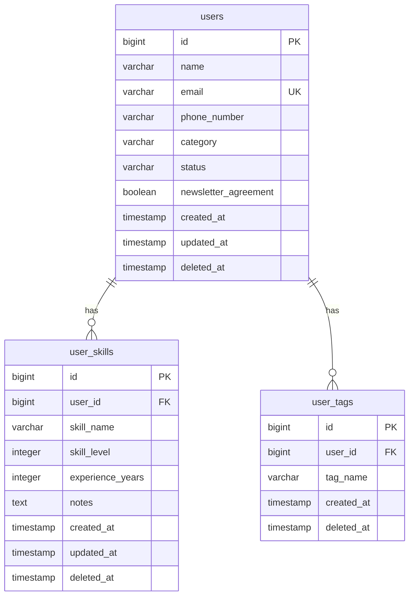

# 3-2 ER図

## 概要
研修生管理システムのデータベース構造を視覚的に表現したER図（Entity Relationship Diagram）です。

## オンライン版ER図

**📊 dbdiagram.io**: [https://dbdiagram.io/d/68adc7561e7a611967b0b2ba](https://dbdiagram.io/d/68adc7561e7a611967b0b2ba)

- チームメンバーとの共有・編集が可能
- リアルタイムでの構造変更確認
- SQL出力機能付き

---

## Mermaid ER図

---

## テーブル関係性

### **1. users ← user_skills（1対多）**
- 1人のユーザーは複数のスキルを持つことができる
- CASCADE DELETE設定により、ユーザー削除時にスキルも論理削除される

### **2. users ← user_tags（1対多）**
- 1人のユーザーは最大4個までのタグを持つことができる
- CASCADE DELETE設定により、ユーザー削除時にタグも論理削除される

---

## 制約事項

### **外部キー制約**
- `user_skills.user_id → users.id`
- `user_tags.user_id → users.id`

### **ユニーク制約**
- `users.email`（論理削除を考慮した部分インデックス）
- `user_tags(user_id, tag_name)`（同一ユーザーの重複タグ防止）

### **チェック制約**
- `user_skills.skill_level`: 0-5の範囲
- `user_skills.experience_years`: 0以上
- `users.status`: '有効' または '無効'

---

## 論理削除パターン

全テーブルに`deleted_at`カラムを実装：
- `NULL`: アクティブなレコード
- `TIMESTAMP`: 論理削除されたレコード（削除日時）

**メリット**:
- データの完全性維持
- 削除履歴の追跡可能
- 誤削除からの復旧対応

---

## インデックス戦略

### **パフォーマンス最適化**
- 論理削除を考慮した部分インデックス
- 検索頻度の高いカラムへの複合インデックス
- N+1問題対策のバッチクエリ実装

詳細なインデックス定義は [3-1-テーブル定義書.md](./3-1-テーブル定義書.md) を参照してください。

---

## 更新履歴

| 更新日 | 変更内容 | 更新者 |
|--------|---------|--------|
| 2025-08-26 | 初版作成、dbdiagram.ioリンク追加 | 開発チーム |

---

## 参考資料

- **テーブル定義**: [3-1-テーブル定義書.md](./3-1-テーブル定義書.md)
- **オンライン編集**: [dbdiagram.io](https://dbdiagram.io/d/68adc7561e7a611967b0b2ba)
- **Spring Data JPA**: [公式ドキュメント](https://spring.io/projects/spring-data-jpa)